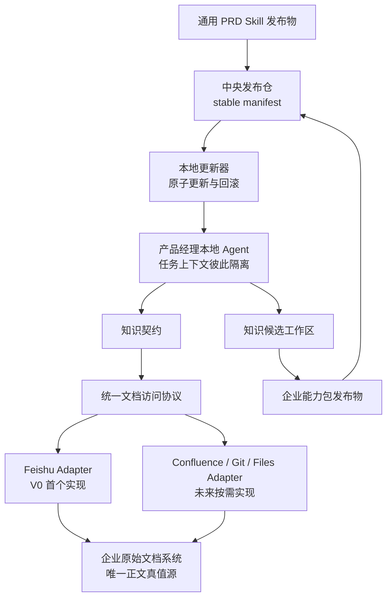
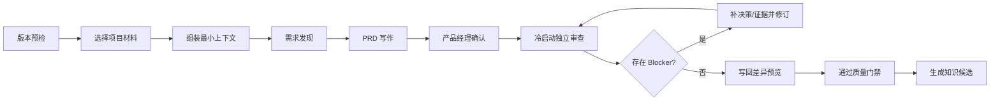

# 企业可复用 PRD Skill 与知识架构设计 Spec

## 1. 文档状态

- 日期：2026-07-26
- 状态：待用户最终审阅
- 首个试点：当前公司的产品团队
- 首个工作流：PRD 生产与独立审查链
- V0 使用入口：产品经理各自在 Claude Code、Codex 等本地 Agent 客户端安装使用

## 2. 背景

现有个人 Skill 已经形成需求发现、竞品分析、PRD 写作、独立审查、实施门禁、知识加载和经验沉淀等工作流，也形成了原文层、正式知识域、能力层以及最小充分 context-pack 等知识架构。

这套系统目前仍然依赖个人环境：

- Skill 中存在个人目录、个人知识分类和个人协作规则。
- 通用方法、个人经验、企业事实和运行逻辑之间尚未形成稳定接口。
- 长期记忆真值源是个人 Obsidian Vault，不能直接提供给企业同事使用。
- 企业已有大量飞书 PRD，但缺少统一的产品文档规范、原型设计规范、产品设计原则和经验治理机制。
- 同事可以安装 Skill，但如果每个人复制一份并独立修改，会迅速形成版本分叉。

因此，企业化目标不是把个人 Skill 文件复制给同事，也不是把个人知识库整体迁移到公司，而是把个人原型拆成可以独立维护、组合和治理的企业能力。

## 3. 产品定位

V0 是一套面向企业产品团队的 AI PRD 工作流落地包：

> 把企业的产品判断标准嵌入需求发现、PRD 写作和独立审查过程，使不同产品经理的 PRD 达到相对一致的质量底线。

价值排序为：

1. 主价值：PRD 质量更稳定，减少模糊规则、场景遗漏和反复评审。
2. 核心机制：企业规范、历史经验和当前项目事实可以按任务正确复用。
3. 结果价值：缩短从需求澄清到可交付 PRD 的周期。

V0 采用企业内部落地项目形态，先在当前公司完成验证，再把可重复部分沉淀为其他企业可配置的交付包。

## 4. 目标与非目标

### 4.1 目标

- 让同事安装同一套 PRD Skill 内核，而不是维护个人分叉版本。
- 把企业稳定规范与通用 Skill 内核分离，使二者可以独立演进并成对发布。
- 建立渠道无关的文档访问协议，避免 Skill 与飞书、Confluence 或其他存储工具深度耦合。
- 不复制企业正在编辑的 PRD 正文，保持原文档系统为唯一正文真值源。
- 通过知识契约控制每一步加载什么、加载多少、以谁为准以及缺失时如何降级。
- 让 Writer 与 Reviewer 使用隔离上下文，建立真实的独立质量门禁。
- 所有运行结果可追溯到 Skill 版本、企业能力包版本和源文档 revision。
- 用 4 周内部试点验证质量稳定性、知识复用效果和效率变化。

### 4.2 非目标

V0 不包括：

- 面向外部客户的多租户 SaaS 或 Web 管理平台。
- 重构公司的完整知识库或搬迁全部历史文档。
- 同时支持所有企业文档系统。
- 自动把历史 PRD 当作企业正式规范。
- 让 AI 自动批准业务决策、自动消除知识冲突或绕过人员权限。
- 在没有人工确认的情况下覆盖原始 PRD。
- 把个人 Obsidian Vault 暴露给同事或企业运行环境。
- 把未经验证的个人经验直接发布为全员规则。

## 5. 核心设计原则

### 5.1 通用能力与企业事实分离

通用 Skill 内核只包含跨企业稳定的工作流、角色、输入输出、检查方法、失败处理和质量门禁。

企业术语、产品边界、业务规则、文档规范、设计原则、历史案例索引和知识源配置进入企业能力包。

### 5.2 原文只保留一个可编辑真值源

员工继续在飞书、Confluence、Git 或其他原系统中维护 PRD。系统不建设第二套可编辑产品文档内容库，也不做两份正文之间的双向同步。

本地缓存和搜索索引只是可丢弃的加速层，不能成为新的内容真值源。

### 5.3 最新等于“最新批准且兼容”

产品经理运行的不是源码仓库中绝对最新的版本，而是公司最新批准、经过验证且彼此兼容的 Skill 与企业能力包稳定组合。

### 5.4 最小充分上下文

Skill 不全量读取企业知识。每个阶段通过知识契约声明必需知识、可选知识、来源范围、加载预算、时效要求、权威顺序和缺失行为。

### 5.5 人对业务判断负责

AI 可以发现缺口、生成草稿、执行审查并阻止不合格 PRD 进入下一阶段，但范围、责任、权限、业务规则冲突和最终发布仍由产品经理或产品负责人确认。

### 5.6 经验先成为候选，再成为规则

运行中发现的重复问题只能生成知识候选。候选附带来源、适用范围和证据，经过 canary 验证与发布确认后才能进入企业稳定规范。

## 6. 总体架构



总体架构包含六类对象：

1. 通用 PRD Skill 内核。
2. 企业能力包。
3. 中央发布与版本控制。
4. 产品经理本地 Agent 运行时。
5. 渠道无关的文档访问协议与 Adapter。
6. 企业原始文档系统及知识候选工作区。

## 7. 组件与所有权

| 组件 | 主要内容 | 所有权与维护 |
| --- | --- | --- |
| 通用 PRD Skill 内核 | 需求发现、写作、审查、质量门禁、失败处理 | 由 Skill 产品维护者维护，可跨企业复用 |
| 企业能力包 | 企业规范、知识契约、案例索引、知识源目录 | 归公司所有；V0 由试点负责人发布 |
| 中央发布仓 | 版本发布物、stable manifest、校验值和回滚记录 | 公司控制，所有产品经理只读取批准版本 |
| 本地更新器 | 检查、下载、校验、切换、回滚和任务快照 | 随 Skill 安装，行为由发布协议约束 |
| Adapter | 将统一文档协议映射到具体文档系统 | V0 实现 Feishu Adapter，后续按企业替换 |
| 原始文档系统 | 当前 PRD、需求背景、评审意见和项目决策 | 企业原系统为唯一正文真值源 |
| 知识候选工作区 | 运行中产生、尚未生效的经验候选 | V0 由试点负责人维护，不分发给普通运行端 |

V0 的规则发布由试点负责人确认。架构预留产品负责人审批：试点稳定后，候选规则由试点负责人提出、产品负责人批准，再进入 stable 能力包。

## 8. 通用 PRD Skill 内核

Skill 内核只负责稳定工作流，不写死企业路径、知识目录或文档平台。

### 8.1 核心能力

- 需求发现：识别目标、用户、角色影响、业务规则、异常路径和证据缺口。
- PRD 写作：把已确认决策写成用户可观察行为、责任、权限、失败处理和验收标准。
- 冷启动审查：用独立上下文检查 PRD，不继承 Writer 的讨论假设。
- 质量分级：输出 Blocker、Major 和 Minor。
- 阶段门禁：存在 Blocker 时不得进入实施计划、原型任务或研发交付。
- 安全写回：写回前检查源文档 revision，默认先展示差异。
- 运行记录：记录版本、来源、降级状态、审查结果和耗时。

### 8.2 Skill 不得包含

- 企业业务事实或机密材料。
- 个人 Vault 的路径与内容。
- 只适用于某家企业的术语、模板和权限规则。
- 具体文档平台的 API 细节。
- 未经确认的企业业务决策。

## 9. 企业能力包

企业能力包是企业稳定知识与运行契约的发布物，不是企业全部文档的镜像。

### 9.1 逻辑结构

```text
company-product-capability/
├── pack.yaml
├── contracts/
├── standards/
├── cases/
├── sources/
└── governance/
    └── candidates/
```

- `pack.yaml`：版本、负责人、发布时间、状态、兼容 Skill 范围、校验值和发布说明。
- `contracts/`：PRD 各阶段的知识契约。
- `standards/`：已经批准的术语、产品边界、PRD 规范、设计原则、业务规则和质量量表。
- `cases/`：标注后的案例索引、关键摘要、适用范围和源文档指针，不复制日常可编辑正文。
- `sources/`：企业知识源目录、Adapter 类型、可查询范围和权限说明。
- `governance/candidates/`：候选规则与证据，仅存在于治理工作区，不进入普通用户的 stable 运行包。

### 9.2 企业知识权威顺序

同一任务中发生冲突时，按以下顺序处理：

1. 当前项目已经由负责人确认的决策。
2. 企业正式规范。
3. 已标注适用范围的历史案例。
4. 通用产品方法。

候选经验不进入权威顺序，批准前只能作为治理材料。

当同级来源冲突或适用范围无法判断时，系统并列展示来源、版本和影响，由产品经理作出决定，不由模型静默选择。

### 9.3 知识契约

每个工作流阶段必须声明：

- `required`：必须加载的知识类型。
- `optional`：有则增强、无则可降级的知识类型。
- `source_scope`：允许查询的业务域、项目和文档范围。
- `authority`：冲突时的权威顺序。
- `freshness`：允许的最大陈旧程度，以及是否必须实时检查 revision。
- `budget`：最多加载的文件、卡片或字符预算。
- `missing_behavior`：缺失时阻止、降级或向用户追问。
- `evidence`：输出是否必须引用来源和版本。
- `writeback`：允许写回的目标、权限和确认门槛。

## 10. 渠道无关的文档访问层

### 10.1 统一协议

Skill 只依赖以下语义接口：

- `search(query, scope)`：在允许范围内搜索文档。
- `read(document_id, revision?)`：读取正文或指定版本。
- `metadata(document_id)`：读取标题、作者、更新时间和类型。
- `revision(document_id)`：获取当前版本标识。
- `check_access(user, document_id, action)`：检查读取或写入权限。

支持写回的 Adapter 必须实现：

- `preview_write(document_id, patch)`：生成写回差异。
- `commit_write(document_id, expected_revision, patch)`：在 revision 未变化且用户确认后写回。

V0 的 Feishu Adapter 必须实现读取、revision 检查、差异预览和受控写回。未来只实现读取能力的 Adapter 仍可接入，但运行状态必须标记为 `Degraded`，由用户手工更新原文。

Adapter 可以进一步扩展 `subscribe_changes(scope)`，用于增量索引；它不是 V0 必需能力。

### 10.2 V0 Adapter 策略

V0 先定义通用协议，再实现 Feishu Adapter。Feishu 是首个实现，不是 Skill 的架构依赖。

未来企业可以替换为 Confluence、Notion、Google Drive、Git 或 Files Adapter；同一家企业也可以配置多个 Adapter。只要符合统一协议，Skill 与知识契约无需修改。

### 10.3 避免双份内容维护

- 当前 PRD 和项目材料始终以原文档系统为准。
- 运行时读取最新 revision，并在任务快照中记录。
- 本地缓存只保存可重建的元数据、摘要和索引。
- 缓存命中时必须与源系统 revision 校验。
- 用户不能直接编辑缓存，因此不存在双向同步。
- 稳定企业规范是从项目经验中经过确认后形成的独立知识发布物，不是工作文档的自动镜像。

## 11. 发布与版本控制

### 11.1 Stable Manifest

中央发布仓维护一份公司当前批准的稳定组合：

```yaml
channel: stable
skill:
  name: enterprise-prd-chain
  version: 1.4.2
  checksum: "<release-checksum>"
company_pack:
  name: company-product-capability
  version: 0.9.5
  checksum: "<release-checksum>"
compatibility:
  skill: ">=1.4.0 <2.0.0"
published_by: pilot-owner
force_update: false
```

逻辑发布仓可以落在公司可访问的私有 Git 仓库或内部对象存储。具体后端属于实施选择，但必须完整支持 manifest、不可变发布物、校验和、原子切换与回滚。

### 11.2 本地更新行为

每次开始新任务前：

1. 更新器查询 stable manifest。
2. 比较本地 Skill 与能力包版本。
3. 若版本落后，下载一组已经批准且兼容的发布物。
4. 校验完整性后一次切换，不允许半更新。
5. 为本次任务锁定版本快照。
6. 任务运行中不热更新；下一次新任务才使用新的 stable 组合。

每份 PRD 和审查报告都记录实际使用的 Skill 与企业能力包版本。

### 11.3 Canary 与回滚

发布流程为：

```text
候选修改 → canary（试点负责人验证）→ stable（全员同步）
                                      ↘ 出现问题时回滚上一稳定组合
```

Skill 与能力包可以分别开发，但 stable manifest 必须一次发布一组兼容版本。

### 11.4 离线和更新失败

- 普通离线：使用最后一次校验通过的 stable 缓存，显示版本和最近同步时间。
- 强制停用版本：阻止新任务并提示联网更新。
- 下载或校验失败：不覆盖旧版本，继续保留上一稳定组合。
- 中央 manifest 不可用：不得自行拉取源码主分支作为替代。

## 12. PRD 生产与独立审查运行链



### 12.1 版本预检

同步最新批准组合并建立任务快照。必需版本无法获得时按发布规则阻止或降级。

### 12.2 选择项目材料

产品经理指定当前 PRD、需求背景和项目决策。Adapter 使用产品经理自身权限读取，不扩大访问范围。

### 12.3 组装最小上下文

按知识契约组合：

1. 当前项目已确认决策。
2. 企业正式规范。
3. 与当前问题直接相关的标注案例。
4. 必要的通用产品方法。

记录文档 ID、revision、读取时间和任何降级状态。

### 12.4 启动门禁

必需知识、必需文档或权限缺失时，系统明确展示缺失内容、用途和影响。知识契约决定阻止、降级或向产品经理追问，不允许静默猜测。

### 12.5 需求发现

Agent 与产品经理确认目标、用户、角色影响、业务规则、权限、异常路径、证据缺口和 V0 范围。

产物包括：

- 已确认事项。
- 未决事项。
- 证据来源。
- 不进入当前版本的排除项。

### 12.6 PRD 写作

Writer 只把已确认决策写成用户可观察行为、业务规则、责任、权限、失败处理和验收标准。未决事项必须显式保留，不能补写成事实。

### 12.7 人工确认

产品经理确认关键业务判断，形成待审版本。V0 不允许 AI 自行确认产品范围和企业责任。

### 12.8 冷启动独立审查

Reviewer 使用全新上下文，只接收：

- 待审 PRD。
- 企业审查标准。
- 必要项目证据。
- Skill、能力包和源文档版本快照。

Reviewer 不接收 Writer 的隐藏推理、完整写作对话和自我辩护。

审查分级：

- `Blocker`：关键行为、责任、权限、业务规则或失败兜底不明确，不能进入实施。
- `Major`：质量明显不足，需要补全，但不一定改变总体方案。
- `Minor`：表达、结构或低风险一致性问题。

### 12.9 质量门禁

存在 Blocker 时，返回产品经理补充决策或证据，由 Writer 修订后重新进入独立审查。

Blocker 清零并完成人工确认后，PRD 才能进入实施计划、原型任务或研发交付。系统记录通过时间、审查轮次和遗留 Minor。

### 12.10 安全写回

V0 默认先生成差异预览，不直接覆盖原文。

写回步骤：

1. 任务开始时记录源文档 revision。
2. 准备写回时重新读取 revision。
3. revision 未变化：展示差异，产品经理确认后写回。
4. revision 已变化：停止覆盖，重新读取并生成合并建议。

### 12.11 经验反哺

系统可以从重复审查问题中生成知识候选，但必须区分：

- 单次项目事实：留在项目文档。
- 跨项目稳定判断：进入候选工作区。

候选附带来源、适用范围、证据和预期影响。通过 canary 验证并确认后，才发布新的企业能力包 stable 版本。

## 13. 运行状态与用户可见行为

| 状态 | 用户看到的结果 | 允许的下一步 |
| --- | --- | --- |
| Ready | 版本、知识和权限检查通过 | 开始需求发现 |
| Degraded | 可选材料缺失、使用缓存或只读快照 | 用户确认风险后继续 |
| Blocked | 必需材料、权限或强制版本缺失 | 补充条件后重试 |
| Drafting | 正在发现需求或写作 | 产品经理持续确认 |
| Reviewing | Reviewer 使用独立上下文审查 | 等待审查结果 |
| Revision Required | 存在 Blocker 或需补充的 Major | 补决策、证据或修订 |
| Passed | Blocker 清零且人工确认 | 写回、实施计划或原型任务 |
| Conflict | 源文档 revision 变化或知识冲突 | 处理合并或人工裁决 |

## 14. 异常与降级

| 异常 | V0 行为 | 是否继续 |
| --- | --- | --- |
| 中央版本检查失败 | 使用最后验证过的 stable 组合，显示版本与最近同步时间 | 普通更新可继续；停用版本阻止 |
| Adapter 不可用 | 允许用户提供只读快照，明确标记非实时来源 | 可降级；禁止自动写回 |
| 缺少访问权限 | 显示缺失文档与用途，不绕过员工权限 | 必需材料阻止；可选材料降级 |
| 必需知识缺失 | 列出缺口和影响 | 按知识契约阻止或要求补充 |
| 同级知识冲突 | 并列展示来源、版本和影响 | 人工裁决前不写成确定事实 |
| 源文档 revision 变化 | 停止覆盖，重新读取并生成合并建议 | 合并确认后继续 |
| Writer 或 Reviewer 失败 | 保留任务快照，允许从最近稳定阶段重试 | 不重复执行已经确认的外部写入 |
| Reviewer 与人工差异过大 | 记录为审查校准样本，不自动修改规则 | 人工作最终判断 |
| 更新下载或校验失败 | 不切换版本，保留上一稳定组合 | 依据 force-update 状态继续或阻止 |

## 15. 权限、安全与审计

- 产品经理使用自己的文档系统身份和权限读取项目材料。
- Adapter 不得扩大权限、复用他人凭证或绕过企业访问控制。
- 个人 Obsidian Vault 不参与同事运行，也不作为企业知识源。
- 企业能力包发布物不打包动态项目正文，降低机密复制和陈旧风险。
- V0 所有外部写回先展示差异并获得用户确认。
- 运行日志默认记录元数据，不集中保存完整 PRD 正文。
- 最小运行记录包括：运行 ID、用户、Skill 版本、能力包版本、Adapter、源文档 ID 与 revision、时间、降级状态、审查结果和耗时。
- 敏感材料是否允许进入模型上下文，继续服从公司现有数据与 AI 使用规则；本设计不绕过或替代该规则。

## 16. 内部试点设计

### 16.1 规模

- 参与者：4–6 位产品经理。
- 周期：4 周。
- 样本：8–12 份真实 PRD。
- 覆盖：不同经验水平和不同产品模块。
- 基线：抽取 6–10 份近期历史 PRD，使用同一质量量表重新评分，并统计历史评审轮次与主要问题。
- 校准：产品负责人混合抽看历史与试点文档，不预先查看 AI 评分。

### 16.2 主指标：PRD 质量稳定度

建议达标线：

- 100% 试点 PRD 完成必需项、来源和版本记录。
- 至少 80% 在一次修订内通过人工质量门禁。
- AI 审查判定通过后，人工不得再发现未决 Blocker。
- 不同产品经理的质量得分离散度较历史基线下降至少 30%。

质量稳定度优先于平均分。企业复用需要证明团队质量下限被抬高，而不是只让少数资深产品经理得到更高分。

比例指标按实际文档数向上取整。由于 V0 样本较小，这些结果只用于内部 go / iterate / stop 决策，不宣称具有统计学意义或直接代表外部企业效果。

### 16.3 知识护栏

- 必需知识缺失 100% 对用户可见。
- 知识冲突不由模型静默裁决。
- 进入 PRD 的企业性结论可以回到来源和版本。
- 候选经验未发布前不影响全员运行。

### 16.4 效率护栏

- 从需求澄清到待审 PRD 的中位耗时较基线下降至少 30%。
- 人工确认步骤没有显著增加。
- 更新、权限和 Adapter 故障不会导致重复丢失已确认工作。

### 16.5 使用护栏

- 至少 70% 参与者愿意继续使用。
- 主要阻力可以归因到具体流程、知识缺口、Adapter 或安装更新问题。
- 参与者能够理解 Blocker 的原因，而不是把门禁视为不可解释的模型结论。

### 16.6 四周后的决策

继续产品化：

- 质量指标达标。
- 没有权限或数据事故。
- 更新和回滚机制稳定。
- 产品经理愿意继续使用。

满足后开始抽象第二个企业 Adapter 和自助安装能力。

继续内部迭代：

- 质量已有提升，但知识缺口、人工负担或工具摩擦仍高。
- 在当前公司继续修正，不对外复制。

停止当前路径：

- 质量没有可辨识改善。
- 使用负担抵消质量与效率收益。
- 出现无法接受的数据、权限或业务责任风险。

## 17. 测试与验证

### 17.1 发布与兼容

- Skill 与能力包可以成对升级。
- 下载或校验失败不会形成半更新。
- stable manifest 可以回滚上一稳定组合。
- 任务运行中不会被热更新打断。
- 输出记录实际运行版本。

### 17.2 Adapter 契约

每个 Adapter 使用同一组契约测试验证：

- 搜索范围正确。
- 正文、元数据和 revision 一致。
- 无权限、失效链接、超时和服务不可用行为一致。
- 写回使用 expected revision，冲突时不会覆盖新版本。
- 非实时快照被明确标记并禁止自动写回。

### 17.3 Skill 黄金样例

建立固定的优质 PRD、缺陷 PRD 和边界案例：

- Writer 不能把未决事项补成事实。
- Reviewer 能稳定发现已知 Blocker 和 Major。
- 企业能力包升级后，黄金样例不发生未解释的质量回退。
- Claude Code、Codex 等支持入口对核心门禁产生一致结果。

### 17.4 权限与并发

- 模拟无权访问必需与可选材料。
- 模拟 PRD 在任务中途被其他同事修改。
- 模拟敏感文档不允许进入上下文。
- 模拟用户拒绝写回。
- 模拟 Adapter 与中央发布仓同时不可用。

### 17.5 试点验收

- 运行记录覆盖所有试点任务。
- 历史基线与试点使用同一评分量表。
- 产品负责人完成盲评抽样。
- 质量、知识、效率和使用护栏均有可复核数据。

## 18. V0 交付边界

V0 最终应交付：

1. 一套通用 PRD Skill 内核。
2. 一套当前公司的企业产品能力包。
3. 一份稳定版本 manifest 与本地更新器。
4. 一份统一文档访问协议。
5. 一个 Feishu Adapter。
6. 一套 Writer、Reviewer 和 Blocker 门禁运行链。
7. 一套知识候选、canary、stable 和回滚流程。
8. 一套试点质量量表、黄金样例和运行记录规范。
9. 一份同事安装、使用、降级和问题反馈说明。

## 19. 后续演进

V0 验证成功后按以下顺序演进：

1. 把安装、更新和环境检查封装成团队自助工具包。
2. 用第二种文档系统实现 Adapter，验证渠道无关协议。
3. 把企业能力包的创建过程标准化为“企业知识最小包”交付模板。
4. 将产品负责人审批、使用指标和版本发布逐步形成轻量管理控制面。
5. 有多个企业稳定复用后，再评估多租户 Skill 与企业知识平台。

在 V0 之前不建设完整平台，避免在工作流价值尚未验证时提前投入账号、权限、审计和多租户基础设施。

## 20. 设计结论

本方案最终采用：

> 通用 Skill 内核 + 企业能力包 + 中央稳定版本组合 + 渠道无关文档访问协议 + 企业原始文档唯一真值源。

当前公司是首个内部试点，飞书是第一个 Adapter，而不是架构依赖。动态 PRD 始终留在原文档系统；稳定企业规范通过知识候选、canary 和 stable 发布形成受控能力包。所有产品经理在新任务开始前自动同步最新批准的兼容版本，任务中锁定快照，并通过冷启动独立审查和 Blocker 门禁保障 PRD 质量下限。
